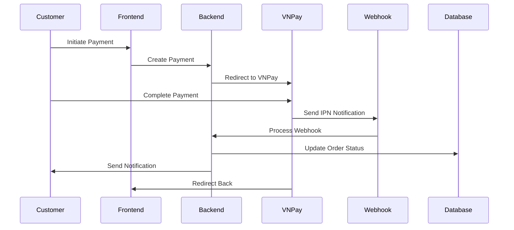

# Hướng Dẫn Sử Dụng Webhook VNPay

## Tổng Quan

Webhook VNPay (hay còn gọi là IPN - Instant Payment Notification) cho phép VNPay gửi thông báo real-time về trạng thái thanh toán đến server của bạn ngay khi có thay đổi.

## Ưu Điểm của Webhook VNPay

### 1. **Real-time Notifications**

- Nhận thông báo ngay lập tức khi thanh toán thành công/thất bại
- Không cần polling để kiểm tra trạng thái thanh toán
- Xử lý đơn hàng tự động và nhanh chóng

### 2. **Độ Tin Cậy Cao**

- VNPay retry webhook nếu server không phản hồi
- Signature verification đảm bảo tính xác thực
- Audit trail đầy đủ với database logging

### 3. **Monitoring & Alerting**

- Theo dõi real-time performance của webhook
- Cảnh báo tự động khi có lỗi
- Dashboard quản lý toàn diện

## Cấu Hình Webhook VNPay

### 1. **Environment Variables**

Cập nhật file `.env` với các thông tin sau:

```env
# VNPay Webhook Configuration
VNPAY_TMN_CODE=your_vnpay_merchant_code
VNPAY_HASH_SECRET=your_vnpay_hash_secret
VNPAY_IPN_URL=https://your-domain.com/api/webhooks/vnpay/ipn

# Webhook Alert Configuration
WEBHOOK_ALERTS_EMAIL_ENABLED=true
WEBHOOK_ALERTS_EMAIL_RECIPIENTS=admin@yourstore.com
```

### 2. **VNPay Merchant Portal Setup**

Trong VNPay Merchant Portal, cấu hình:

1. **IPN URL**: `https://your-domain.com/api/webhooks/vnpay/ipn`
2. **Return URL**: `https://your-frontend.com/payment/result`
3. **Webhook Security**: Bật signature verification

## Cách Thức Hoạt Động

### 1. **Payment Flow**



### 2. **Webhook Processing**

Khi VNPay gửi webhook:

1. **Signature Verification**: Xác thực tính hợp lệ
2. **Duplicate Detection**: Tránh xử lý trùng lặp
3. **Order Update**: Cập nhật trạng thái đơn hàng
4. **Notifications**: Gửi email/SMS cho khách hàng
5. **Audit Logging**: Lưu trữ log để audit

## Code Examples

### 1. **Tạo Payment với Webhook**

```typescript
// In your payment service
async createVNPayPayment(orderData: CreateOrderDto) {
  const payment = await this.paymentsService.createVNPayPayment({
    amount: orderData.total,
    orderInfo: `Thanh toan don hang ${orderData.orderNumber}`,
    ipAddr: orderData.clientIP,
    // VNPay sẽ gửi webhook đến VNPAY_IPN_URL
  });

  return payment;
}
```

### 2. **Custom Webhook Handler**

```typescript
// Custom logic sau khi webhook được xử lý
@Injectable()
export class CustomWebhookHandler {
  async handleSuccessfulPayment(order: Order, webhookData: VNPayWebhookDto) {
    // Custom business logic
    await this.inventoryService.updateStock(order.items);
    await this.loyaltyService.addPoints(order.userId, order.total);
    await this.analyticsService.trackPurchase(order);
  }
}
```

## Webhook Endpoints Có Sẵn

### 1. **Main Webhook Endpoint**

```
POST /api/webhooks/vnpay/ipn
```

- Nhận IPN từ VNPay
- Xác thực signature
- Xử lý thanh toán
- Gửi notifications

### 2. **Webhook Health Check**

```
GET /api/webhooks/vnpay/health
```

- Kiểm tra trạng thái webhook system
- Monitoring metrics
- Performance statistics

### 3. **Webhook Testing**

```
POST /api/webhooks/vnpay/test
```

- Test webhook functionality
- Simulate payment scenarios
- Debug webhook issues

## Monitoring Dashboard

### 1. **Admin Dashboard**

```
GET /api/admin/webhook-dashboard/overview
```

- Tổng quan webhook performance
- Real-time metrics
- Error rates và alerts

### 2. **Webhook Events**

```
GET /api/admin/webhook-dashboard/events
```

- Lịch sử webhook events
- Filter và search
- Export data

## Testing Webhook

### 1. **Sử dụng Script Test**

```bash
# Test basic webhook
node scripts/test-webhook.js

# Test với custom data
node scripts/test-webhook.js --order-id ORD123 --amount 100000

# Load testing
node scripts/test-webhook.js --load-test --requests 100
```

### 2. **Test Manual**

```bash
# Test webhook health
curl -X GET https://your-domain.com/api/webhooks/vnpay/health

# Test với ngrok (cho local development)
npx ngrok http 3001
# Cập nhật VNPAY_IPN_URL trong VNPay portal
```

## Security Best Practices

### 1. **Signature Verification**

- Luôn verify signature từ VNPay
- Sử dụng secret key được VNPay cung cấp
- Log các webhook có signature không hợp lệ

### 2. **IP Whitelisting**

```typescript
// Trong production, chỉ accept webhook từ IP của VNPay
const vnpayIPs = [
  '113.160.92.202',
  '113.160.92.203',
  // ... other VNPay IPs
];
```

### 3. **Rate Limiting**

```typescript
// Protect webhook endpoint
@Throttle(100, 60) // 100 requests per minute
async handlePaymentNotification() {
  // ...
}
```

## Troubleshooting

### 1. **Webhook Không Được Gọi**

- Kiểm tra IPN URL trong VNPay portal
- Verify HTTPS certificate
- Check firewall/security groups

### 2. **Signature Verification Failed**

- Kiểm tra VNPAY_HASH_SECRET
- Verify parameter ordering
- Check encoding (UTF-8)

### 3. **Performance Issues**

- Monitor processing time < 5s
- Check database connection pool
- Review error rates

## Production Deployment

### 1. **Environment Setup**

```env
NODE_ENV=production
VNPAY_URL=https://pay.vnpay.vn/vpcpay.html
VNPAY_IPN_URL=https://your-production-domain.com/api/webhooks/vnpay/ipn
```

### 2. **Load Balancer Configuration**

- Health check: `/api/webhooks/vnpay/health`
- Sticky sessions: Not required
- Timeout: 30 seconds

### 3. **Monitoring**

- Set up alerts for webhook failures
- Monitor response times
- Track error rates

## FAQ

**Q: Webhook có reliable không?**
A: Có, VNPay sẽ retry webhook nếu không nhận được response 200. Hệ thống cũng có monitoring và alerting.

**Q: Có thể test webhook trong development không?**
A: Có, sử dụng ngrok hoặc các script test có sẵn trong `scripts/` folder.

**Q: Webhook có bảo mật không?**
A: Có, sử dụng HMAC-SHA512 signature verification và có thể thêm IP whitelisting.

**Q: Performance của webhook như thế nào?**
A: System được thiết kế xử lý > 1000 webhook/minute với response time < 3s.

---

Với hệ thống webhook VNPay này, bạn có thể xử lý thanh toán real-time một cách đáng tin cậy và hiệu quả!
